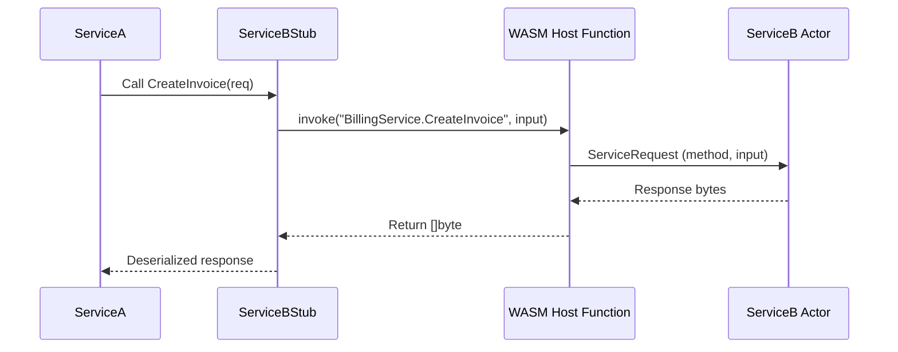

# OKRA Architecture Overview

This document provides high-level visual diagrams of the OKRA system, covering:

- Core runtime components
- How services are registered, invoked, and routed
- The flow of both external (ConnectRPC) and internal (actor-based) service calls

---

## High-Level Runtime Architecture

```mermaid
flowchart TD
    subgraph OKRA Runtime
        Connect[ConnectRPC/gRPC Server]
        ActorSystem[GoAKT Actor System]
        Registry[Service Registry + Config Loader]
        WorkerPool[WASM Worker Pool(s)]
    end

    subgraph WASM Module
        WASMActor1["WASMActor (UserService)"]
        WASMActor2["WASMActor (BillingService)"]
    end

    Client[External Client] -->|RPC (HTTP/gRPC)| Connect
    Connect -->|ServiceRequest| ActorSystem
    ActorSystem -->|Message| WASMActor1
    ActorSystem -->|Message| WASMActor2
    WASMActor1 --> WorkerPool
    WASMActor2 --> WorkerPool
    Registry --> ActorSystem
    Registry --> WorkerPool
```

## Service Call Flow (External → Actor → Worker)
```mermaid
sequenceDiagram
    participant Client
    participant RPCServer as ConnectRPC
    participant Actor as WASMActor
    participant Pool as WorkerPool
    participant Module as handle_request()

    Client->>RPCServer: Protobuf Request (e.g. CreateUser)
    RPCServer->>Actor: ServiceRequest (method, input bytes)
    Actor->>Pool: Invoke(method, input)
    Pool->>Module: handle_request(method, input)
    Module-->>Pool: Serialized Protobuf response
    Pool-->>Actor: Response bytes
    Actor-->>RPCServer: ServiceResponse
    RPCServer-->>Client: Protobuf Response
```

### Internal Service-to-Service Flow

