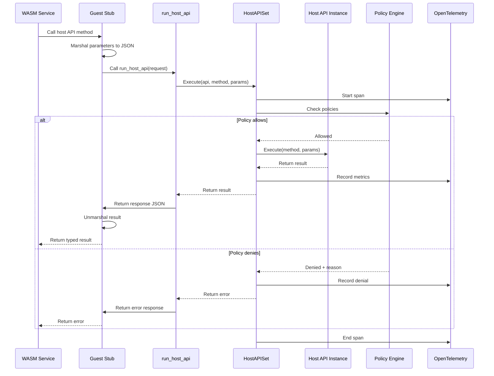
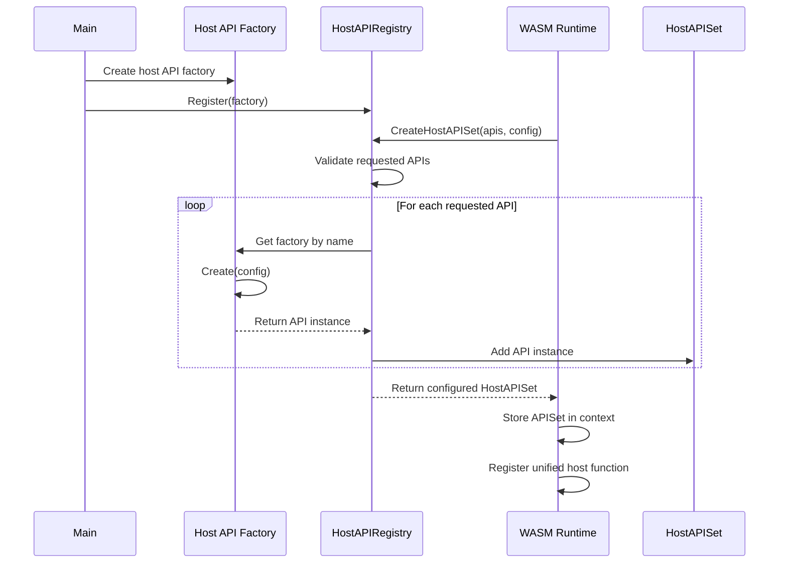

# Host API Interface Design

## Overview

The Host API Interface is the foundational layer that enables OKRA services (running in WASM) to access system capabilities through a controlled, policy-enforced mechanism with built-in observability. This design establishes the patterns and infrastructure that all host APIs must follow.

### Problem Statement

WASM services run in a sandboxed environment and cannot directly access system resources like databases, network, or file systems. We need a secure, performant way to expose these capabilities while maintaining:
- Security boundaries through capability-based access control
- Automatic observability for all host API calls
- Policy enforcement at both code and configuration levels
- Type safety across the WASM boundary
- Consistent error handling and context propagation

### Goals

1. **Define the host API registration mechanism** - How host functions are registered with the Wazero runtime
2. **Establish the interface pattern** - Common patterns all host APIs must follow
3. **Implement policy enforcement** - Both code-level and CEL-based policies
4. **Add OpenTelemetry instrumentation** - Automatic tracing and metrics for all calls
5. **Enable guest-side stub generation** - Type-safe wrappers for easy consumption
6. **Support context propagation** - Trace IDs, deadlines, and metadata flow

### Non-Goals

1. Implementing specific host APIs (okra.state, okra.log, etc.) - those come later
2. Creating a plugin system for third-party host APIs
3. Supporting host APIs written in languages other than Go
4. Dynamic host API loading at runtime


## Interfaces & APIs

### Constants

```go
// Resource limit constants
const (
    // DefaultMaxIteratorsPerService is the default maximum number of concurrent iterators per service
    DefaultMaxIteratorsPerService = 100
    
    // DefaultIteratorTimeout is the default timeout for idle iterators
    DefaultIteratorTimeout = 5 * time.Minute
    
    // DefaultMaxRequestSize is the default maximum size for incoming requests (10MB)
    DefaultMaxRequestSize = 10 * 1024 * 1024
    
    // DefaultMaxResponseSize is the default maximum size for outgoing responses (10MB) 
    DefaultMaxResponseSize = 10 * 1024 * 1024
    
    // ErrorCodeResponseTooLarge indicates the response exceeded size limits
    ErrorCodeResponseTooLarge = "RESPONSE_TOO_LARGE"
    
    // ErrorCodeHostAPISetClosed indicates operations on a closed HostAPISet
    ErrorCodeHostAPISetClosed = "HOST_API_SET_CLOSED"
    
    // ErrorCodeAPINotFound indicates the requested API doesn't exist
    ErrorCodeAPINotFound = "API_NOT_FOUND"
    
    // ErrorCodePolicyError indicates policy evaluation failed
    ErrorCodePolicyError = "POLICY_ERROR"
    
    // ErrorCodePolicyDenied indicates the request was denied by policy
    ErrorCodePolicyDenied = "POLICY_DENIED"
    
    // ErrorCodeInternalError indicates an unexpected error occurred
    ErrorCodeInternalError = "INTERNAL_ERROR"
    
    // ErrorCodeIteratorNotFound indicates the iterator ID is invalid
    ErrorCodeIteratorNotFound = "ITERATOR_NOT_FOUND"
    
    // ErrorCodeIteratorLimitExceeded indicates too many concurrent iterators
    ErrorCodeIteratorLimitExceeded = "ITERATOR_LIMIT_EXCEEDED"
)

// WASM memory error indicators
const (
    // NullPointer indicates a null pointer error in WASM memory operations
    NullPointer = uint32(0)
    
    // ZeroLength indicates zero length in WASM memory operations
    ZeroLength = uint32(0)
    
    // ErrorBitMask is used to indicate an error in the high bit of the return value
    ErrorBitMask = uint64(1 << 63)
)
```

### Core Interfaces

```go
// HostAPI defines the interface that all host APIs must implement
type HostAPI interface {
    // Name returns the namespace for this API (e.g., "okra.state")
    Name() string
    
    // Version returns the semantic version of this API
    Version() string
    
    // Execute handles a method call with JSON parameters
    Execute(ctx context.Context, method string, parameters json.RawMessage) (json.RawMessage, error)
}

// StreamingHostAPI extends HostAPI to support iterator-based methods
type StreamingHostAPI interface {
    HostAPI
    
    // ExecuteStreaming handles streaming method calls
    // Returns the response JSON and optionally an iterator
    ExecuteStreaming(ctx context.Context, method string, parameters json.RawMessage) (json.RawMessage, Iterator, error)
}

// Host APIs that hold resources (DB connections, file handles, etc.) should also
// implement io.Closer to enable proper cleanup when the WASM instance terminates

// HostAPIFactory creates instances of a host API for specific services
type HostAPIFactory interface {
    // Name returns the namespace for this API (e.g., "okra.state")
    Name() string
    
    // Version returns the semantic version of this API
    Version() string
    
    // Create creates a new instance of the host API for a specific service
    Create(ctx context.Context, config HostAPIConfig) (HostAPI, error)
    
    // Methods returns metadata about available methods for stub generation
    Methods() []MethodMetadata
}

// MethodMetadata provides information about a host API method
type MethodMetadata struct {
    Name        string            `json:"name"`
    Description string            `json:"description"`
    Parameters  *spec.Schema      `json:"parameters"`  // JSON schema for parameters
    Returns     *spec.Schema      `json:"returns"`     // JSON schema for return value
    Errors      []ErrorMetadata   `json:"errors"`
    Streaming   bool              `json:"streaming"`   // True if this method returns an iterator
}

// Note: spec is imported from "github.com/go-openapi/spec"
// Using structured schemas provides several benefits:
// 1. Type safety when defining schemas
// 2. Validation of schema definitions at compile time
// 3. Rich tooling support (autocomplete, refactoring)
// 4. Easy conversion to JSON Schema when needed
// 5. Programmatic schema manipulation and introspection

// ErrorMetadata describes possible errors a method can return
type ErrorMetadata struct {
    Code        string `json:"code"`
    Description string `json:"description"`
}

// HostAPIConfig provides configuration to a host API during initialization
type HostAPIConfig struct {
    // Runtime configuration
    ServiceName    string // Fully qualified service name (e.g., "acme-corp/user-service")
    ServiceVersion string // Full semantic version (e.g., "v1.2.3", not just "v1")
    Environment    string // Deployment environment (e.g., "production", "staging", "development")
    
    // Policy engine for CEL evaluation
    PolicyEngine PolicyEngine
    
    // Telemetry providers
    Tracer  trace.Tracer
    Meter   metric.Meter
    Logger  slog.Logger
    
    // Service-specific configuration from okra.json
    Config config.Config // The full okra.json configuration
    
    // Resource limits
    MaxIteratorsPerService int           // Maximum concurrent iterators (0 = use DefaultMaxIteratorsPerService)
    IteratorTimeout        time.Duration // Iterator idle timeout (0 = use DefaultIteratorTimeout)
    MaxRequestSize         int           // Maximum request size in bytes (0 = use DefaultMaxRequestSize)
    MaxResponseSize        int           // Maximum response size in bytes (0 = use DefaultMaxResponseSize)
}

// PolicyEngine evaluates CEL-based policies
type PolicyEngine interface {
    // Evaluate checks if a host API call is allowed
    Evaluate(ctx context.Context, check PolicyCheck) (PolicyDecision, error)
}

// PolicyCheck represents a request to check a policy
type PolicyCheck struct {
    Service string                 // calling service (e.g., "acme-corp/user-service")
    Request HostAPIRequest         // the full request being evaluated
    Context map[string]interface{} // additional context for CEL (e.g., time, IP, etc.)
}

// PolicyDecision represents the result of a policy check
type PolicyDecision struct {
    Allowed bool
    Reason  string
    Metadata map[string]interface{} // e.g., rate limit remaining
}
```

### Host API Registry

```go
// HostAPIRegistry manages all available host API factories
type HostAPIRegistry interface {
    // Register adds a new host API factory
    Register(factory HostAPIFactory) error
    
    // Get retrieves a host API factory by name
    Get(name string) (HostAPIFactory, bool)
    
    // List returns all registered API factories
    List() []HostAPIFactory
    
    // CreateHostAPISet creates a set of host API instances for a specific service
    CreateHostAPISet(ctx context.Context, apis []string, config HostAPIConfig) (HostAPISet, error)
}

// HostAPISet contains all host API instances for a specific service
type HostAPISet interface {
    // Get retrieves a specific host API instance
    Get(name string) (HostAPI, bool)
    
    // Execute routes a request to the appropriate host API
    Execute(ctx context.Context, apiName, method string, parameters json.RawMessage) (json.RawMessage, error)
    
    // NextIterator advances an iterator and returns the next chunk
    NextIterator(ctx context.Context, iteratorID string) (json.RawMessage, bool, error)
    
    // CloseIterator cleans up iterator resources
    CloseIterator(ctx context.Context, iteratorID string) error
    
    // CleanupStaleIterators removes iterators older than the timeout
    CleanupStaleIterators() int
    
    // Config returns the configuration for this host API set
    Config() HostAPIConfig
    
    // Close cleans up all host API resources
    // Should be called after the WASM instance has terminated
    Close() error
}

// DefaultHostAPIRegistry is the concrete implementation
type defaultHostAPIRegistry struct {
    factories map[string]HostAPIFactory
    mu        sync.RWMutex
}

// CreateHostAPISet creates a set of host API instances for a specific service
func (r *defaultHostAPIRegistry) CreateHostAPISet(ctx context.Context, apis []string, config HostAPIConfig) (HostAPISet, error) {
    r.mu.RLock()
    defer r.mu.RUnlock()
    
    hostAPIs := make(map[string]HostAPI)
    
    // Create instances for each requested API
    for _, apiName := range apis {
        factory, ok := r.factories[apiName]
        if !ok {
            return nil, fmt.Errorf("host API %s not found", apiName)
        }
        
        api, err := factory.Create(ctx, config)
        if err != nil {
            // Cleanup already created APIs
            for _, created := range hostAPIs {
                if closer, ok := created.(io.Closer); ok {
                    closer.Close()
                }
            }
            return nil, fmt.Errorf("failed to create %s: %w", apiName, err)
        }
        
        hostAPIs[apiName] = api
    }
    
    return &defaultHostAPISet{
        apis:      hostAPIs,
        iterators: make(map[string]*iteratorInfo), // Initialize iterator storage
        config:    config,
        closed:    false,
    }, nil
}

// Iterator represents an active iterator for streaming data
// Note: We don't use Go 1.23's iter.Seq pattern here because:
// 1. We need explicit resource management (Close method)
// 2. Iterators must be serializable across WASM boundary
// 3. We need to track iterator state on the host side
// 4. Error handling needs to be explicit, not panic-based
type Iterator interface {
    // Next returns the next chunk of data and whether more data is available
    Next(ctx context.Context) (json.RawMessage, bool, error)
    // Close cleans up iterator resources
    Close() error
}

// IteratorInfo tracks iterator metadata
type iteratorInfo struct {
    iterator  Iterator
    apiName   string
    method    string
    createdAt time.Time
}

// defaultHostAPISet is the concrete implementation of HostAPISet
// Each WASM instance gets its own HostAPISet, but we still need synchronization
// because host-side Go code may have concurrent access patterns
type defaultHostAPISet struct {
    apis         map[string]HostAPI
    iterators    map[string]*iteratorInfo  // Active iterators
    config       HostAPIConfig
    closed       bool  // Defensive: tracks if Close() has been called
    mu           sync.RWMutex // Protects iterators and closed state
}

// Compile-time interface compliance checks
var (
    _ HostAPISet = (*defaultHostAPISet)(nil)
    _ HostAPIRegistry = (*defaultHostAPIRegistry)(nil)
)

// Get retrieves a specific host API instance
func (s *defaultHostAPISet) Get(name string) (HostAPI, bool) {
    api, ok := s.apis[name]
    return api, ok
}

// Execute routes a request to the appropriate host API with cross-cutting concerns
func (s *defaultHostAPISet) Execute(ctx context.Context, apiName, method string, parameters json.RawMessage) (json.RawMessage, error) {
    // Defensive check: ensure we're not using a closed HostAPISet
    s.mu.RLock()
    if s.closed {
        s.mu.RUnlock()
        return nil, &HostAPIError{
            Code:    ErrorCodeHostAPISetClosed,
            Message: "HostAPISet has been closed - this indicates improper lifecycle management",
            Details: "Execute called after Close()",
        }
    }
    s.mu.RUnlock()
    
    // Get the API instance
    api, ok := s.apis[apiName]
    if !ok {
        return nil, &HostAPIError{
            Code:    ErrorCodeAPINotFound,
            Message: fmt.Sprintf("host API %s not found", apiName),
        }
    }
    
    // Start telemetry span
    ctx, span := s.config.Tracer.Start(ctx, fmt.Sprintf("host.%s.%s", apiName, method))
    defer span.End()
    
    // Policy check
    serviceInfo, _ := ctx.Value(serviceInfoKey{}).(ServiceInfo)
    decision, err := s.config.PolicyEngine.Evaluate(ctx, PolicyCheck{
        Service: serviceInfo.Name,
        Request: HostAPIRequest{
            API:        apiName,
            Method:     method,
            Parameters: parameters,
            Metadata:   RequestMetadata{ServiceInfo: serviceInfo},
        },
        Context: make(map[string]interface{}),
    })
    
    if err != nil {
        span.RecordError(err)
        return nil, &HostAPIError{
            Code:    ErrorCodePolicyError,
            Message: fmt.Sprintf("policy evaluation failed: %v", err),
        }
    }
    
    if !decision.Allowed {
        return nil, &HostAPIError{
            Code:    ErrorCodePolicyDenied,
            Message: decision.Reason,
        }
    }
    
    // Execute the API method
    start := time.Now()
    var result json.RawMessage
    var err error
    
    // Check if this API supports streaming and if this is a streaming method
    if streamingAPI, ok := api.(StreamingHostAPI); ok {
        // Check method metadata to see if this is a streaming method
        // In practice, we'd look this up from the factory's Methods()
        var iterator Iterator
        result, iterator, err = streamingAPI.ExecuteStreaming(ctx, method, parameters)
        
        // If we got an iterator, register it
        if err == nil && iterator != nil {
            var streamResp StreamingResponse
            if json.Unmarshal(result, &streamResp) == nil && streamResp.IteratorID != "" {
                s.mu.Lock()
                
                // Check iterator limit
                maxIterators := s.config.MaxIteratorsPerService
                if maxIterators == 0 {
                    maxIterators = DefaultMaxIteratorsPerService
                }
                if len(s.iterators) >= maxIterators {
                    s.mu.Unlock()
                    iterator.Close() // Clean up the iterator
                    return nil, &HostAPIError{
                        Code:    ErrorCodeIteratorLimitExceeded,
                        Message: fmt.Sprintf("maximum concurrent iterators (%d) exceeded", maxIterators),
                    }
                }
                
                s.iterators[streamResp.IteratorID] = &iteratorInfo{
                    iterator:  iterator,
                    apiName:   apiName,
                    method:    method,
                    createdAt: time.Now(),
                }
                s.mu.Unlock()
            }
        }
    } else {
        // Regular non-streaming execution
        result, err = api.Execute(ctx, method, parameters)
    }
    duration := time.Since(start)
    
    // Record metrics
    s.config.Meter.RecordBatch(ctx,
        metric.Int64Counter("host_api_calls").Add(1,
            metric.WithAttributes(
                attribute.String("api", apiName),
                attribute.String("method", method),
                attribute.Bool("success", err == nil),
            ),
        ),
        metric.Float64Histogram("host_api_duration_ms").Record(float64(duration.Milliseconds()),
            metric.WithAttributes(
                attribute.String("api", apiName),
                attribute.String("method", method),
            ),
        ),
    )
    
    if err != nil {
        span.RecordError(err)
        s.config.Logger.Error("host API call failed",
            "api", apiName,
            "method", method,
            "error", err,
            "duration_ms", duration.Milliseconds(),
        )
        return nil, err
    }
    
    return result, nil
}

// NextIterator advances an iterator and returns the next chunk
func (s *defaultHostAPISet) NextIterator(ctx context.Context, iteratorID string) (json.RawMessage, bool, error) {
    // Defensive check with proper locking
    s.mu.RLock()
    if s.closed {
        s.mu.RUnlock()
        return nil, false, &HostAPIError{
            Code:    ErrorCodeHostAPISetClosed,
            Message: "HostAPISet has been closed",
        }
    }
    
    // Get iterator while holding read lock
    info, ok := s.iterators[iteratorID]
    s.mu.RUnlock()
    
    if !ok {
        return nil, false, &HostAPIError{
            Code:    ErrorCodeIteratorNotFound,
            Message: fmt.Sprintf("iterator %s not found", iteratorID),
        }
    }
    
    // Validate iterator belongs to calling service (from context)
    if serviceInfo, ok := ctx.Value(serviceInfoKey{}).(ServiceInfo); ok {
        // In practice, we'd store service info with the iterator and validate here
        // For now, we'll add a TODO
        // TODO: Add service validation to prevent cross-service iterator access
    }
    
    // Start telemetry span
    ctx, span := s.config.Tracer.Start(ctx, fmt.Sprintf("host.%s.%s.next", info.apiName, info.method))
    defer span.End()
    
    // Get next chunk
    start := time.Now()
    data, hasMore, err := info.iterator.Next(ctx)
    duration := time.Since(start)
    
    // Record metrics
    s.config.Meter.RecordBatch(ctx,
        metric.Int64Counter("host_api_iterator_calls").Add(1,
            metric.WithAttributes(
                attribute.String("api", info.apiName),
                attribute.String("method", info.method),
                attribute.Bool("success", err == nil),
                attribute.Bool("has_more", hasMore),
            ),
        ),
        metric.Float64Histogram("host_api_iterator_duration_ms").Record(float64(duration.Milliseconds()),
            metric.WithAttributes(
                attribute.String("api", info.apiName),
                attribute.String("method", info.method),
            ),
        ),
    )
    
    if err != nil {
        span.RecordError(err)
        return nil, false, err
    }
    
    // Auto-cleanup if no more data
    if !hasMore {
        info.iterator.Close()
        s.mu.Lock()
        delete(s.iterators, iteratorID)
        s.mu.Unlock()
    }
    
    return data, hasMore, nil
}

// CloseIterator cleans up iterator resources
func (s *defaultHostAPISet) CloseIterator(ctx context.Context, iteratorID string) error {
    s.mu.Lock()
    info, ok := s.iterators[iteratorID]
    if !ok {
        s.mu.Unlock()
        return nil // Already closed or never existed
    }
    
    delete(s.iterators, iteratorID)
    s.mu.Unlock()
    
    // Close iterator outside of lock to avoid potential deadlock
    err := info.iterator.Close()
    
    s.config.Logger.Debug("iterator closed",
        "iterator_id", iteratorID,
        "api", info.apiName,
        "method", info.method,
        "duration", time.Since(info.createdAt),
    )
    
    return err
}

// CleanupStaleIterators removes iterators older than the timeout
func (s *defaultHostAPISet) CleanupStaleIterators() int {
    timeout := s.config.IteratorTimeout
    if timeout == 0 {
        timeout = DefaultIteratorTimeout
    }
    
    now := time.Now()
    
    s.mu.Lock()
    staleIterators := make(map[string]*iteratorInfo)
    for id, info := range s.iterators {
        if now.Sub(info.createdAt) > timeout {
            staleIterators[id] = info
            delete(s.iterators, id)
        }
    }
    s.mu.Unlock()
    
    // Close stale iterators outside of lock
    for id, info := range staleIterators {
        if err := info.iterator.Close(); err != nil {
            s.config.Logger.Error("failed to close stale iterator",
                "iterator_id", id,
                "api", info.apiName,
                "method", info.method,
                "age", now.Sub(info.createdAt),
                "error", err,
            )
        }
    }
    
    return len(staleIterators)
}

// Close cleans up all host API resources
func (s *defaultHostAPISet) Close() error {
    // Defensive: prevent double close with proper locking
    s.mu.Lock()
    if s.closed {
        s.mu.Unlock()
        return nil  // Idempotent - already closed
    }
    
    // Mark as closed first to prevent new operations
    s.closed = true
    
    // Copy iterators to close outside of lock
    iteratorsToClose := make(map[string]*iteratorInfo)
    for id, info := range s.iterators {
        iteratorsToClose[id] = info
    }
    s.iterators = nil
    s.mu.Unlock()
    
    var errs []error
    
    // Close all active iterators
    for id, info := range iteratorsToClose {
        if err := info.iterator.Close(); err != nil {
            errs = append(errs, fmt.Errorf("failed to close iterator %s: %w", id, err))
        }
    }
    
    // Close each host API if it implements io.Closer
    for name, api := range s.apis {
        if closer, ok := api.(io.Closer); ok {
            if err := closer.Close(); err != nil {
                errs = append(errs, fmt.Errorf("failed to close %s: %w", name, err))
            }
        }
    }
    
    if len(errs) > 0 {
        return fmt.Errorf("errors closing host APIs: %v", errs)
    }
    
    return nil
}

// Config returns the configuration for this host API set
func (s *defaultHostAPISet) Config() HostAPIConfig {
    return s.config
}
```

### Unified Host API Interface

**Design Decision - Single Entry Point**: Instead of exposing multiple host functions, we'll use a single unified interface that all host APIs go through. This provides:
- Consistent policy enforcement point
- Simplified telemetry and logging
- Easier WASM boundary interface
- Mirrors the guest-side handle_request pattern

**Design Decision - Module Namespace**: We use "okra" as the module namespace for host functions instead of the common "env" convention. This:
- Clearly identifies these as OKRA-specific host functions
- Avoids confusion with environment variables
- Maintains clarity in import statements (`import "okra" "run_host_api"`)
- Follows the pattern of other WASM runtimes that use their own namespaces (e.g., "wasi_snapshot_preview1" for WASI)

**Design Decision - Iterator Pattern**: We use a traditional iterator pattern with explicit `Next()` methods rather than Go 1.23's `iter.Seq` pattern because:
- **Cross-boundary constraints**: Iterators must work across the WASM boundary where we can't pass function closures
- **Resource management**: We need explicit lifecycle control (iterator IDs, cleanup)
- **Error handling**: Network-like operations need explicit error returns, not panic-based flow
- **Compatibility**: Guest stubs can provide `iter.Seq` adapters for idiomatic Go usage while maintaining the underlying protocol

```go
// HostAPIRequest represents a request to any host API
type HostAPIRequest struct {
    API        string          `json:"api"`        // e.g., "okra.state"
    Method     string          `json:"method"`     // e.g., "get"
    Parameters json.RawMessage `json:"parameters"` // Method-specific parameters
    Metadata   RequestMetadata `json:"metadata"`   // Request context, trace info, etc.
}

// HostAPIResponse represents the response from any host API
type HostAPIResponse struct {
    Success bool            `json:"success"`
    Data    json.RawMessage `json:"data,omitempty"`    // Success response data
    Error   *HostAPIError   `json:"error,omitempty"`   // Error details if failed
}

// HostAPIError provides structured error information
type HostAPIError struct {
    Code    string `json:"code"`    // e.g., "PERMISSION_DENIED"
    Message string `json:"message"` // Human-readable error message
    Details string `json:"details,omitempty"` // Additional error context
}

// RequestMetadata carries request context
type RequestMetadata struct {
    TraceID     string            `json:"traceId,omitempty"`
    SpanID      string            `json:"spanId,omitempty"`
    Baggage     map[string]string `json:"baggage,omitempty"`
    ServiceInfo ServiceInfo       `json:"serviceInfo"`
}

// ServiceInfo identifies the calling service
type ServiceInfo struct {
    Name    string `json:"name"`    // e.g., "acme-corp/user-service"
    Version string `json:"version"` // e.g., "v1.2.3"
}

// NextRequest represents a request to get the next chunk from an iterator
type NextRequest struct {
    IteratorID string `json:"iteratorId"` // The iterator to advance
    // Reserved for future extensions (e.g., batch size hints)
}

// NextResponse represents the response from a next() call
type NextResponse struct {
    Success bool            `json:"success"`
    Data    json.RawMessage `json:"data,omitempty"`     // Next chunk of data
    HasMore bool            `json:"hasMore,omitempty"`  // True if more data available
    Error   *HostAPIError   `json:"error,omitempty"`    // Error details if failed
}

// StreamingResponse is returned by streaming methods
type StreamingResponse struct {
    IteratorID string `json:"iteratorId"` // ID to use for subsequent next() calls
    HasData    bool   `json:"hasData"`    // False if no results at all
}
```

The host functions exposed to WASM:

```go
// Context keys for passing data through the call stack
type (
    hostAPISetKey struct{}
    serviceInfoKey struct{}
    memoryKey struct{}
    moduleKey struct{}
    iteratorKey struct{ id string }
)
// RunHostAPI is the single entry point for all host API calls
// It's exposed to WASM as "okra.run_host_api"
// The hostAPISet is retrieved from the context, set during WASM module instantiation
func RunHostAPI(ctx context.Context, requestJSON string) (string, error) {
    // Get the host API set for this service instance
    hostAPISet, ok := ctx.Value(hostAPISetKey{}).(HostAPISet)
    if !ok {
        return "", fmt.Errorf("host API set not found in context")
    }
    
    // Parse request
    var req HostAPIRequest
    if err := json.Unmarshal([]byte(requestJSON), &req); err != nil {
        return "", fmt.Errorf("invalid request format: %w", err)
    }
    
    // Execute the method via the host API set
    // HostAPISet.Execute handles all cross-cutting concerns:
    // - API routing
    // - Telemetry (tracing and metrics)
    // - Policy enforcement
    // - Error handling
    result, err := hostAPISet.Execute(ctx, req.API, req.Method, req.Parameters)
    if err != nil {
        // Convert error to HostAPIError format
        var apiErr *HostAPIError
        if errors.As(err, &apiErr) {
            resp := HostAPIResponse{
                Success: false,
                Error:   apiErr,
            }
            respJSON, _ := json.Marshal(resp)
            return string(respJSON), nil
        }
        
        // Generic error
        resp := HostAPIResponse{
            Success: false,
            Error: &HostAPIError{
                Code:    ErrorCodeInternalError,
                Message: err.Error(),
            },
        }
        respJSON, _ := json.Marshal(resp)
        return string(respJSON), nil
    }
    
    // Return success response
    resp := HostAPIResponse{
        Success: true,
        Data:    result,
    }
    respJSON, _ := json.Marshal(resp)
    return string(respJSON), nil
}

// NextIterator is the entry point for iterator advancement
// It's exposed to WASM as "okra.next"
func NextIterator(ctx context.Context, requestJSON string) (string, error) {
    // Get the host API set for this service instance
    hostAPISet, ok := ctx.Value(hostAPISetKey{}).(HostAPISet)
    if !ok {
        return "", fmt.Errorf("host API set not found in context")
    }
    
    // Parse request
    var req NextRequest
    if err := json.Unmarshal([]byte(requestJSON), &req); err != nil {
        return "", fmt.Errorf("invalid next request format: %w", err)
    }
    
    // Get next chunk from iterator
    data, hasMore, err := hostAPISet.NextIterator(ctx, req.IteratorID)
    if err != nil {
        // Convert error to NextResponse format
        var apiErr *HostAPIError
        if errors.As(err, &apiErr) {
            resp := NextResponse{
                Success: false,
                Error:   apiErr,
            }
            respJSON, _ := json.Marshal(resp)
            return string(respJSON), nil
        }
        
        // Generic error
        resp := NextResponse{
            Success: false,
            Error: &HostAPIError{
                Code:    ErrorCodeInternalError,
                Message: err.Error(),
            },
        }
        respJSON, _ := json.Marshal(resp)
        return string(respJSON), nil
    }
    
    // Return success response
    resp := NextResponse{
        Success: true,
        Data:    data,
        HasMore: hasMore,
    }
    respJSON, _ := json.Marshal(resp)
    return string(respJSON), nil
}
```

### Guest-Side Generated Stubs

Generated stubs would use this unified interface:

```go
// Generated Go stub for state API
package state

import (
    "encoding/json"
    "fmt"
    "iter"
    
    // These types would be imported from a shared package
    // "github.com/okra/sdk/go/hostapi"
)

// Request/response types for state API
type GetRequest struct {
    Key string `json:"key"`
}

type GetResponse struct {
    Value []byte `json:"value"`
}

type SetRequest struct {
    Key   string `json:"key"`
    Value []byte `json:"value"`
}

type ListKeysRequest struct {
    Prefix string `json:"prefix"`
    Limit  int    `json:"limit,omitempty"`
}

type ListKeysResponse struct {
    IteratorID string `json:"iteratorId"`
    HasData    bool   `json:"hasData"`
}

type KeysChunk struct {
    Keys []string `json:"keys"`
}

// Import the host functions from the "okra" module
//go:wasmimport okra run_host_api
func hostRunHostAPI(requestPtr, requestLen uint32) (responsePtr uint32, responseLen uint32)

//go:wasmimport okra next
func hostNext(requestPtr, requestLen uint32) (responsePtr uint32, responseLen uint32)

// Client provides access to the okra.state host API
type Client struct{}

// NewClient creates a new state API client
func NewClient() *Client {
    return &Client{}
}

// Note: In the actual implementation, these types would be imported from a shared package
type HostAPIRequest struct {
    API        string          `json:"api"`
    Method     string          `json:"method"`
    Parameters json.RawMessage `json:"parameters"`
    Metadata   RequestMetadata `json:"metadata"`
}

type HostAPIResponse struct {
    Success bool            `json:"success"`
    Data    json.RawMessage `json:"data,omitempty"`
    Error   *HostAPIError   `json:"error,omitempty"`
}

// HostAPIError - reused from the shared types above

// RequestMetadata and ServiceInfo - reused from the shared types above

// callHostAPI handles the low-level WASM boundary crossing
// Note: This is a simplified example. In practice, the guest stub would
// coordinate with the main WASM wrapper which exports allocate/deallocate
func callHostAPI(request string) (string, error) {
    // In a real implementation, this would:
    // 1. Marshal the request to JSON bytes
    // 2. Call the host function with proper memory management
    // 3. Unmarshal the response
    // For now, we'll show a conceptual implementation
    
    // The actual implementation would use the allocate/deallocate functions
    // exported by the main WASM module (not this stub)
    // This is typically handled by the WASM wrapper generated by OKRA
    
    // Conceptual call - actual implementation would handle memory properly
    // responseJSON := hostRunHostAPI(requestJSON)
    // return responseJSON, nil
    
    // Placeholder for example
    return "", fmt.Errorf("actual implementation provided by WASM wrapper")
}

// Get retrieves a value from state storage
func (c *Client) Get(key string) ([]byte, error) {
    params := GetRequest{Key: key}
    paramsJSON, err := json.Marshal(params)
    if err != nil {
        return nil, fmt.Errorf("failed to marshal parameters: %w", err)
    }
    
    req := HostAPIRequest{
        API:        "okra.state",
        Method:     "get",
        Parameters: paramsJSON,
        Metadata:   RequestMetadata{}, // Populated by runtime if needed
    }
    
    reqJSON, err := json.Marshal(req)
    if err != nil {
        return nil, fmt.Errorf("failed to marshal request: %w", err)
    }
    
    respJSON, err := callHostAPI(string(reqJSON))
    if err != nil {
        return nil, err
    }
    
    var resp HostAPIResponse
    if err := json.Unmarshal([]byte(respJSON), &resp); err != nil {
        return nil, fmt.Errorf("invalid response format: %w", err)
    }
    
    if !resp.Success {
        return nil, fmt.Errorf("%s: %s", resp.Error.Code, resp.Error.Message)
    }
    
    var result GetResponse
    if err := json.Unmarshal(resp.Data, &result); err != nil {
        return nil, fmt.Errorf("invalid response data: %w", err)
    }
    
    return result.Value, nil
}

// Set stores a value in state storage
func (c *Client) Set(key string, value []byte) error {
    params := SetRequest{
        Key:   key,
        Value: value,
    }
    
    paramsJSON, err := json.Marshal(params)
    if err != nil {
        return fmt.Errorf("failed to marshal parameters: %w", err)
    }
    
    req := HostAPIRequest{
        API:        "okra.state",
        Method:     "set",
        Parameters: paramsJSON,
        Metadata:   RequestMetadata{}, // Populated by runtime if needed
    }
    
    reqJSON, err := json.Marshal(req)
    if err != nil {
        return fmt.Errorf("failed to marshal request: %w", err)
    }
    
    respJSON, err := callHostAPI(string(reqJSON))
    if err != nil {
        return err
    }
    
    var resp HostAPIResponse
    if err := json.Unmarshal([]byte(respJSON), &resp); err != nil {
        return fmt.Errorf("invalid response format: %w", err)
    }
    
    if !resp.Success {
        return fmt.Errorf("%s: %s", resp.Error.Code, resp.Error.Message)
    }
    
    return nil
}

// KeyIterator provides iteration over keys
// Note: This doesn't follow Go 1.23's iter.Seq pattern because we need to
// maintain state across the WASM boundary. However, we provide an All()
// method that returns a standard iterator for idiomatic Go usage.
type KeyIterator struct {
    iteratorID string
    hasMore    bool
}

// Next returns the next batch of keys (traditional iterator pattern)
func (it *KeyIterator) Next() ([]string, error) {
    if !it.hasMore {
        return nil, nil
    }
    
    req := NextRequest{
        IteratorID: it.iteratorID,
    }
    
    reqJSON, err := json.Marshal(req)
    if err != nil {
        return nil, fmt.Errorf("failed to marshal next request: %w", err)
    }
    
    respJSON, err := callHostAPINext(string(reqJSON))
    if err != nil {
        return nil, err
    }
    
    var resp NextResponse
    if err := json.Unmarshal([]byte(respJSON), &resp); err != nil {
        return nil, fmt.Errorf("invalid next response format: %w", err)
    }
    
    if !resp.Success {
        return nil, fmt.Errorf("%s: %s", resp.Error.Code, resp.Error.Message)
    }
    
    // Update iterator state
    it.hasMore = resp.HasMore
    
    // Unmarshal the chunk data
    var chunk KeysChunk
    if err := json.Unmarshal(resp.Data, &chunk); err != nil {
        return nil, fmt.Errorf("invalid chunk data: %w", err)
    }
    
    return chunk.Keys, nil
}

// All returns a Go 1.23-style iterator over all keys
// This allows usage with range: for key := range iter.All() { ... }
func (it *KeyIterator) All() iter.Seq[string] {
    return func(yield func(string) bool) {
        for it.hasMore {
            keys, err := it.Next()
            if err != nil {
                // In practice, we might want to handle errors differently
                // For now, we stop iteration on error
                return
            }
            
            for _, key := range keys {
                if !yield(key) {
                    // Caller requested early termination
                    // TODO: Consider calling CloseIterator to free resources
                    return
                }
            }
        }
    }
}

// ListKeys returns an iterator for all keys matching a prefix
func (c *Client) ListKeys(prefix string, limit int) (*KeyIterator, error) {
    params := ListKeysRequest{
        Prefix: prefix,
        Limit:  limit,
    }
    
    paramsJSON, err := json.Marshal(params)
    if err != nil {
        return nil, fmt.Errorf("failed to marshal parameters: %w", err)
    }
    
    req := HostAPIRequest{
        API:        "okra.state",
        Method:     "listKeys",
        Parameters: paramsJSON,
        Metadata:   RequestMetadata{},
    }
    
    reqJSON, err := json.Marshal(req)
    if err != nil {
        return nil, fmt.Errorf("failed to marshal request: %w", err)
    }
    
    respJSON, err := callHostAPI(string(reqJSON))
    if err != nil {
        return nil, err
    }
    
    var resp HostAPIResponse
    if err := json.Unmarshal([]byte(respJSON), &resp); err != nil {
        return nil, fmt.Errorf("invalid response format: %w", err)
    }
    
    if !resp.Success {
        return nil, fmt.Errorf("%s: %s", resp.Error.Code, resp.Error.Message)
    }
    
    var result ListKeysResponse
    if err := json.Unmarshal(resp.Data, &result); err != nil {
        return nil, fmt.Errorf("invalid response data: %w", err)
    }
    
    return &KeyIterator{
        iteratorID: result.IteratorID,
        hasMore:    result.HasData,
    }, nil
}

// callHostAPINext is similar to callHostAPI but calls the next function
func callHostAPINext(request string) (string, error) {
    // Same implementation pattern as callHostAPI but calls hostNext
    return "", fmt.Errorf("actual implementation provided by WASM wrapper")
}
```

### Integration with WASM Runtime

```go
// Updates to WASMCompiledModule
type WASMCompiledModule interface {
    // ... existing methods ...
    
    // WithHostAPIs configures which host APIs this module can access
    WithHostAPIs(apis []string) WASMCompiledModule
}

// Updates to compiledModule struct
type compiledModule struct {
    // ... existing fields ...
    
    hostAPIs []string
    registry HostAPIRegistry
}

// Updated instantiation in NewInstance
func (m *compiledModule) NewInstance(ctx context.Context) (WASMInstance, error) {
    // Create host API set for this service instance
    hostAPISet, err := m.registry.CreateHostAPISet(ctx, m.hostAPIs, HostAPIConfig{
        ServiceName:    m.serviceName,
        ServiceVersion: m.serviceVersion,
        Environment:    m.environment,
        PolicyEngine:   m.policyEngine,
        Tracer:        m.tracer,
        Meter:         m.meter,
        Logger:        m.logger,
        Config:        m.config,
    })
    if err != nil {
        return nil, fmt.Errorf("failed to create host API set: %w", err)
    }
    
    // Store host API set and service info in context for RunHostAPI
    ctx = context.WithValue(ctx, hostAPISetKey{}, hostAPISet)
    ctx = context.WithValue(ctx, serviceInfoKey{}, ServiceInfo{
        Name:    m.serviceName,
        Version: m.serviceVersion,
    })
    
    // Register the unified host function with Wazero
    err = RegisterHostAPI(ctx, m.runtime, hostAPISet)
    if err != nil {
        return nil, fmt.Errorf("failed to register host API: %w", err)
    }
    
    // ... rest of instantiation ...
}
```

## Component Interactions

### Host API Call Flow



### Host API Registration Flow



## Implementation Approach

### 1. Host API Implementation Pattern

With the factory pattern, we separate the factory (registered once) from instances (created per service):

```go
// Factory implementation for state API
type stateAPIFactory struct{}

func NewStateAPIFactory() HostAPIFactory {
    return &stateAPIFactory{}
}

func (f *stateAPIFactory) Name() string { return "okra.state" }
func (f *stateAPIFactory) Version() string { return "v1.0.0" }

func (f *stateAPIFactory) Create(ctx context.Context, config HostAPIConfig) (HostAPI, error) {
    // Create service-specific state store based on config
    store, err := createStateStore(config)
    if err != nil {
        return nil, fmt.Errorf("failed to create state store: %w", err)
    }
    
    return &stateAPI{
        store:       store,
        logger:      config.Logger.With("api", "okra.state", "service", config.ServiceName),
        serviceName: config.ServiceName,
    }, nil
}

func (f *stateAPIFactory) Methods() []MethodMetadata {
    return []MethodMetadata{
        {
            Name:        "get",
            Description: "Retrieve a value from state storage",
            Parameters: spec.ObjectProperty().
                WithProperties(map[string]spec.Schema{
                    "key": *spec.StringProperty().WithDescription("The key to retrieve"),
                }).
                WithRequired("key"),
            Returns: spec.ObjectProperty().
                WithProperties(map[string]spec.Schema{
                    "value": *spec.StringProperty().
                        WithDescription("The stored value").
                        WithFormat("byte"), // base64 encoded
                }),
            Errors: []ErrorMetadata{
                {Code: "KEY_NOT_FOUND", Description: "The requested key does not exist"},
            },
        },
        {
            Name:        "set",
            Description: "Store a value in state storage",
            Parameters: spec.ObjectProperty().
                WithProperties(map[string]spec.Schema{
                    "key":   *spec.StringProperty().WithDescription("The key to store"),
                    "value": *spec.StringProperty().
                        WithDescription("The value to store").
                        WithFormat("byte"), // base64 encoded
                }).
                WithRequired("key", "value"),
            Returns: spec.ObjectProperty(), // Empty object
            Errors: []ErrorMetadata{
                {Code: "STORAGE_ERROR", Description: "Failed to store the value"},
            },
        },
        {
            Name:        "listKeys",
            Description: "List all keys matching a prefix",
            Streaming:   true, // This method returns an iterator
            Parameters: spec.ObjectProperty().
                WithProperties(map[string]spec.Schema{
                    "prefix": *spec.StringProperty().WithDescription("Key prefix to match"),
                    "limit":  *spec.IntegerProperty().WithDescription("Max keys per chunk"),
                }).
                WithRequired("prefix"),
            Returns: spec.ObjectProperty().
                WithProperties(map[string]spec.Schema{
                    "iteratorId": *spec.StringProperty().WithDescription("Iterator ID for next() calls"),
                    "hasData":    *spec.BoolProperty().WithDescription("True if any keys match"),
                }),
            Errors: []ErrorMetadata{
                {Code: "INVALID_PREFIX", Description: "Invalid key prefix"},
            },
        },
    }
}

// Request/response types for state API methods
type GetRequest struct {
    Key string `json:"key"`
}

type GetResponse struct {
    Value []byte `json:"value"`
}

type SetRequest struct {
    Key   string `json:"key"`
    Value []byte `json:"value"`
}

type ListKeysRequest struct {
    Prefix string `json:"prefix"`
    Limit  int    `json:"limit,omitempty"` // Default: 100
}

type ListKeysResponse struct {
    IteratorID string `json:"iteratorId"`
    HasData    bool   `json:"hasData"`
}

// Iterator response chunk
type KeysChunk struct {
    Keys []string `json:"keys"`
}

// stateKeyIterator implements Iterator for listing keys
type stateKeyIterator struct {
    store    StateStore
    prefix   string
    limit    int
    offset   int
    complete bool
}

func (i *stateKeyIterator) Next(ctx context.Context) (json.RawMessage, bool, error) {
    if i.complete {
        return nil, false, nil
    }
    
    // Get next chunk from store
    keys, hasMore, err := i.store.ListKeys(ctx, i.prefix, i.limit, i.offset)
    if err != nil {
        return nil, false, err
    }
    
    i.offset += len(keys)
    i.complete = !hasMore
    
    chunk := KeysChunk{Keys: keys}
    data, err := json.Marshal(chunk)
    if err != nil {
        return nil, false, err
    }
    
    return data, hasMore, nil
}

func (i *stateKeyIterator) Close() error {
    // Cleanup if needed
    return nil
}

// Instance implementation of state API
type stateAPI struct {
    store       StateStore
    logger      slog.Logger
    serviceName string
}

func (s *stateAPI) Name() string { return "okra.state" }
func (s *stateAPI) Version() string { return "v1.0.0" }

func (s *stateAPI) Execute(ctx context.Context, method string, params json.RawMessage) (json.RawMessage, error) {
    switch method {
    case "get":
        var req GetRequest
        if err := json.Unmarshal(params, &req); err != nil {
            return nil, fmt.Errorf("invalid get parameters: %w", err)
        }
        
        value, err := s.store.Get(ctx, req.Key)
        if err != nil {
            return nil, err
        }
        
        resp := GetResponse{Value: value}
        return json.Marshal(resp)
        
    case "set":
        var req SetRequest
        if err := json.Unmarshal(params, &req); err != nil {
            return nil, fmt.Errorf("invalid set parameters: %w", err)
        }
        
        if err := s.store.Set(ctx, req.Key, req.Value); err != nil {
            return nil, err
        }
        
        return json.Marshal(struct{}{})
        
    case "listKeys":
        var req ListKeysRequest
        if err := json.Unmarshal(params, &req); err != nil {
            return nil, fmt.Errorf("invalid listKeys parameters: %w", err)
        }
        
        // Default limit
        if req.Limit == 0 {
            req.Limit = 100
        }
        
        // Create iterator
        iterator := &stateKeyIterator{
            store:  s.store,
            prefix: req.Prefix,
            limit:  req.Limit,
            offset: 0,
        }
        
        // Check if there's any data
        _, hasData, err := iterator.Next(ctx)
        if err != nil {
            return nil, err
        }
        // Reset for actual iteration
        iterator.offset = 0
        iterator.complete = false
        
        // Generate iterator ID
        iteratorID := uuid.New().String()
        
        // Store iterator in context for later retrieval
        // This is handled by the calling code that manages iterators
        ctx = context.WithValue(ctx, iteratorKey{id: iteratorID}, iterator)
        
        // Return streaming response
        resp := ListKeysResponse{
            IteratorID: iteratorID,
            HasData:    hasData,
        }
        return json.Marshal(resp)
        
    default:
        return nil, fmt.Errorf("unknown method: %s", method)
    }
}

// Close implements io.Closer to clean up resources
func (s *stateAPI) Close() error {
    // If the state store implements io.Closer, close it
    if closer, ok := s.store.(io.Closer); ok {
        return closer.Close()
    }
    return nil
}
```

### 2. Memory Management

**Design Decision - Direct Wazero Memory Access**: Since we're only passing JSON strings between host and guest, we use Wazero's built-in memory access directly:

- `api.Memory.Read(ptr, len)` - Read JSON request from guest
- `api.Memory.Write(ptr, data)` - Write JSON response to guest
- Guest exports `allocate(size)` function for memory allocation
- Guest exports `deallocate(ptr, size)` for cleanup (if needed)

This approach is simple and sufficient for JSON string exchange. No additional abstraction layer is needed.

### 3. WASM Function Registration

With the unified interface, we only need to register a single host function:

```go
// RegisterHostAPI registers the unified host API function with Wazero
func RegisterHostAPI(ctx context.Context, runtime wazero.Runtime, hostAPISet HostAPISet) error {
    // Store the hostAPISet in a closure so it's accessible to the host function
    // This is safe because each WASM instance has its own hostAPISet
    
    // Get configuration for limits
    config := hostAPISet.Config()
    maxRequestSize := config.MaxRequestSize
    if maxRequestSize == 0 {
        maxRequestSize = DefaultMaxRequestSize
    }
    maxResponseSize := config.MaxResponseSize
    if maxResponseSize == 0 {
        maxResponseSize = DefaultMaxResponseSize
    }
    
    // Create the host module
    // Using "okra" namespace to clearly identify these as OKRA host functions
    // and avoid confusion with "env" which suggests environment variables
    builder := runtime.NewHostModuleBuilder("okra")
    
    // Helper function to handle WASM memory operations
    handleHostCall := func(ctx context.Context, module api.Module, stack []uint64, handler func(context.Context, string) (string, error)) {
        // Extract parameters from stack
        requestPtr := uint32(stack[0])
        requestLen := uint32(stack[1])
        
        // Validate request size
        if requestLen > uint32(maxRequestSize) {
            stack[0] = NullPointer
            stack[1] = ZeroLength
            return
        }
        
        // Read request from WASM memory
        requestBytes, ok := module.Memory().Read(requestPtr, requestLen)
        if !ok {
            stack[0] = NullPointer
            stack[1] = ZeroLength
            return
        }
        
        // Add hostAPISet to context
        ctx = context.WithValue(ctx, hostAPISetKey{}, hostAPISet)
        
        // Execute the handler
        response, err := handler(ctx, string(requestBytes))
        if err != nil {
            // This should not happen as handlers return error in the response
            stack[0] = NullPointer
            stack[1] = ZeroLength
            return
        }
        
        // Write response to WASM memory
        respBytes := []byte(response)
        
        // Validate response size
        if len(respBytes) > maxResponseSize {
            // Return error response for oversized response
            errResp := map[string]interface{}{
                "success": false,
                "error": map[string]string{
                    "code":    ErrorCodeResponseTooLarge,
                    "message": fmt.Sprintf("response size %d exceeds limit %d", len(respBytes), maxResponseSize),
                },
            }
            respBytes, _ = json.Marshal(errResp)
        }
        
        // Get the guest's allocate function
        allocate := module.ExportedFunction("allocate")
        if allocate == nil {
            stack[0] = NullPointer
            stack[1] = ZeroLength
            return
        }
        
        // Allocate memory in guest for response
        results, err := allocate.Call(ctx, uint64(len(respBytes)))
        if err != nil || len(results) == 0 {
            stack[0] = NullPointer
            stack[1] = ZeroLength
            return
        }
        respPtr := uint32(results[0])
        
        // Ensure we deallocate on any error
        deallocate := module.ExportedFunction("deallocate")
        deallocateOnError := func() {
            if deallocate != nil && respPtr != 0 {
                deallocate.Call(ctx, uint64(respPtr))
            }
        }
        
        // Write response to allocated memory
        if !module.Memory().Write(respPtr, respBytes) {
            deallocateOnError()
            stack[0] = NullPointer
            stack[1] = ZeroLength
            return
        }
        
        // Return pointer and length
        stack[0] = uint64(respPtr)
        stack[1] = uint64(len(respBytes))
    }
    
    // Register run_host_api function
    builder.NewFunctionBuilder().
        WithGoModuleFunction(api.GoModuleFunc(func(ctx context.Context, module api.Module, stack []uint64) {
            handleHostCall(ctx, module, stack, RunHostAPI)
        }), []api.ValueType{
            api.ValueTypeI32, // requestPtr
            api.ValueTypeI32, // requestLen
        }, []api.ValueType{
            api.ValueTypeI32, // responsePtr
            api.ValueTypeI32, // responseLen
        }).
        Export("run_host_api")
        
    // Register the next function for iterator support
    builder.NewFunctionBuilder().
        WithGoModuleFunction(api.GoModuleFunc(func(ctx context.Context, module api.Module, stack []uint64) {
            handleHostCall(ctx, module, stack, NextIterator)
        }), []api.ValueType{
            api.ValueTypeI32, // requestPtr
            api.ValueTypeI32, // requestLen
        }, []api.ValueType{
            api.ValueTypeI32, // responsePtr
            api.ValueTypeI32, // responseLen
        }).
        Export("next")
        
    // Instantiate the module with both functions
    _, err := builder.Instantiate(ctx)
    return err
}
```

### 4. Guest-Side Stub Generation

Generate TypeScript/Go stubs from host API metadata:

```go
// StubGenerator generates guest-side stubs
type StubGenerator interface {
    // GenerateGo generates Go stubs for a host API factory
    GenerateGo(factory HostAPIFactory) ([]byte, error)
    
    // GenerateTypeScript generates TypeScript stubs for a host API factory
    GenerateTypeScript(factory HostAPIFactory) ([]byte, error)
}
```

### 5. Host API Registration at Startup

```go
// InitializeHostAPIs registers all available host API factories
func InitializeHostAPIs(registry HostAPIRegistry) error {
    // Register core host APIs
    factories := []HostAPIFactory{
        NewStateAPIFactory(),
        NewLogAPIFactory(),
        NewEnvAPIFactory(),
        NewSecretsAPIFactory(),
        NewFetchAPIFactory(),
    }
    
    for _, factory := range factories {
        if err := registry.Register(factory); err != nil {
            return fmt.Errorf("failed to register %s: %w", factory.Name(), err)
        }
    }
    
    return nil
}

// Example usage in main
func main() {
    // Create the registry
    registry := NewHostAPIRegistry()
    
    // Register all host API factories
    if err := InitializeHostAPIs(registry); err != nil {
        log.Fatal(err)
    }
    
    // Registry is now ready to create host API sets for services
    // ...
}
```

### 6. Benefits of Structured Schemas for Tooling

Using `spec.Schema` instead of JSON strings enables powerful tooling capabilities:

```go
// Schema validation at compile time
func validateMethodSchemas(factory HostAPIFactory) error {
    for _, method := range factory.Methods() {
        // Validate parameter schema
        if method.Parameters == nil {
            return fmt.Errorf("method %s missing parameter schema", method.Name)
        }
        
        // Ensure parameters are objects (not arrays, primitives, etc.)
        if !method.Parameters.Type.Contains("object") {
            return fmt.Errorf("method %s parameters must be an object", method.Name)
        }
        
        // Check for required fields
        if method.Parameters.Required != nil {
            for _, req := range method.Parameters.Required {
                if _, ok := method.Parameters.Properties[req]; !ok {
                    return fmt.Errorf("method %s requires non-existent property: %s", 
                        method.Name, req)
                }
            }
        }
    }
    return nil
}

// Generate TypeScript types from schemas
func generateTypeScriptTypes(method MethodMetadata) string {
    var w writer.Writer
    
    // Generate parameter interface
    w.P("interface %sParams {", strings.Title(method.Name))
    for name, prop := range method.Parameters.Properties {
        w.P("  %s%s: %s;", name, 
            requiredMarker(method.Parameters.Required, name),
            schemaToTSType(prop))
    }
    w.P("}")
    
    // Generate return type interface
    if method.Returns != nil && len(method.Returns.Properties) > 0 {
        w.P("interface %sResponse {", strings.Title(method.Name))
        for name, prop := range method.Returns.Properties {
            w.P("  %s: %s;", name, schemaToTSType(prop))
        }
        w.P("}")
    }
    
    return w.String()
}

// Convert schema to JSON Schema for documentation
func (m MethodMetadata) ParametersAsJSON() ([]byte, error) {
    return json.MarshalIndent(m.Parameters, "", "  ")
}

// Schema introspection for validation
func hasFileUpload(schema *spec.Schema) bool {
    if schema == nil {
        return false
    }
    
    for _, prop := range schema.Properties {
        if prop.Type.Contains("string") && prop.Format == "binary" {
            return true
        }
        // Recursively check nested objects
        if prop.Type.Contains("object") {
            if hasFileUpload(&prop) {
                return true
            }
        }
    }
    return false
}
```

**Code Generation Pattern**: OKRA already has a well-established code generation system:
- Interface-based `Generator` pattern in `internal/codegen`
- Registry for language-specific generators
- Programmatic generation (not template-based) using `writer` package
- We should follow this pattern for host API stub generation
- Can reuse the `writer` package for consistent formatting
- Should register host API generators in the existing registry

## Test Strategy

### Unit Tests

1. **HostAPIRegistry**
   - Test registration and retrieval
   - Test duplicate registration handling
   - Test host API set creation

2. **RunHostAPI function**
   - Test request/response marshaling
   - Test policy enforcement
   - Test telemetry recording
   - Test error handling
   - Test API routing

3. **HostAPISet Close**
   - Test closing APIs that implement io.Closer
   - Test closing APIs that don't implement io.Closer
   - Test error handling during close
   - Test idempotency of Close

### Integration Tests

1. **End-to-end host API calls**
   - Create a test host API
   - Call from WASM module
   - Verify policy enforcement
   - Verify telemetry data

2. **Policy engine integration**
   - Test CEL expression evaluation
   - Test policy updates
   - Test rate limiting

3. **Context propagation**
   - Test trace ID propagation
   - Test deadline propagation
   - Test metadata propagation

### Performance Tests

1. **Host API call overhead**
   - Measure baseline WASM function call
   - Measure with policy check
   - Measure with full telemetry

2. **Memory transfer performance**
   - Test various payload sizes
   - Test frequent small calls vs large calls

## Implementation Guidance

### Use Named Constants

**IMPORTANT**: When implementing this design, always use the named constants defined at the beginning of this document instead of magic numbers. This ensures:
- Code readability and self-documentation
- Easy updates if limits need to change
- Consistency across the codebase
- Clear semantic meaning for each value

Examples:
- Use `DefaultMaxIteratorsPerService` instead of `100`
- Use `ErrorCodePolicyDenied` instead of `"POLICY_DENIED"`
- Use `NullPointer` and `ZeroLength` for WASM error returns
- Use `DefaultMaxRequestSize` instead of `10 * 1024 * 1024`

### Error Code Consistency

Always use the predefined error code constants when creating `HostAPIError` instances. This ensures:
- Consistent error codes that clients can rely on
- Easy searching for all uses of a particular error
- Type safety through constant usage
- Clear documentation of all possible error codes

### Resource Limit Handling

When implementing resource limits:
- Always check if a limit is set to 0 and use the default constant
- Document the default value in comments referencing the constant
- Use semantic names that clearly indicate what is being limited

```go
// Example:
maxIterators := config.MaxIteratorsPerService
if maxIterators == 0 {
    maxIterators = DefaultMaxIteratorsPerService // Use default of 100
}
```

## Error Handling

### Error Categories

1. **Policy Errors** - Request denied by policy
2. **Parameter Errors** - Invalid parameters or encoding
3. **Resource Errors** - Underlying resource unavailable
4. **Internal Errors** - Bugs or unexpected conditions

### Error Propagation

The `HostAPIError` struct (defined earlier) is used throughout the system for consistent error handling. It's already JSON-compatible and avoids any protobuf dependencies, making it perfect for cross-boundary communication with guest code.

## Performance Considerations

### Optimization Strategies

1. **Policy Caching**
   - Cache CEL expression compilation
   - Cache frequently evaluated policies
   - Invalidate on policy updates

2. **Memory Pooling**
   - Pool buffers for parameter encoding
   - Reuse memory allocations

3. **Batch Operations**
   - Design APIs to support batch operations
   - Reduce boundary crossing overhead

### Benchmarks

Key metrics to track:
- Host API call latency (p50, p95, p99)
- Policy evaluation time
- Memory allocation per call
- Throughput under load

## Security Considerations

### Capability-Based Security

1. **Principle of Least Privilege**
   - Services only get APIs they explicitly request
   - Functions check permissions per operation

2. **Input Validation**
   - All inputs validated before processing
   - Size limits enforced
   - Type safety enforced

3. **Resource Limits**
   - Rate limiting per service
   - Memory usage limits
   - Timeout enforcement

### Audit Trail

All host API calls are logged with:
- Calling service identity
- API and function called
- Policy decision
- Execution result
- Performance metrics

## Open Questions

1. **Async Operations**
   - How do we handle long-running operations?
   - Should we support callbacks or polling?
**Design Decision**: All host API calls will be synchronous/blocking. This aligns with WASM's single-threaded execution model and OKRA's worker pool architecture for concurrency. 

2. **Streaming Data** - ✅ IMPLEMENTED
   - Streaming is now fully integrated into the design
   - Methods marked with `streaming: true` return iterators
   - Dedicated `okra.next` host function for iterator advancement
   - Host manages iterator lifecycle and cleanup
   - Generated stubs provide language-appropriate iterator wrappers 

3. **Transaction Support**
   - How do we handle operations that span multiple host APIs?
**Clarification**: This was referring to operations like:
1. Read from database (okra.sql)
2. Update cache (okra.cache)
3. Log result (okra.log)

But you're right - these are just sequential host API calls, not true transactions. 
   - Do we need distributed transaction support?
**Design Decision**: No special transaction support at the host/guest boundary. Individual host APIs (like okra.sql) can expose their own transaction methods if needed. The host API layer just provides the transport.

4. **Error Recovery**
   - Should host APIs support automatic retry?
**Design Decision**: No automatic retries at the host API layer. Keep it simple and predictable. Retries should be handled by:
- Guest code using language-specific retry libraries
- Individual host APIs that choose to implement retry logic internally
   - How do we handle partial failures?
**Design Principle**: Treat the host API boundary as a simple RPC mechanism. Each call either succeeds or fails atomically. Host APIs should behave like normal Go libraries, with language stubs providing idiomatic wrappers. 

5. **Performance Targets**
   - What's acceptable overhead for a host API call?
**Performance Testing Plan**: We'll benchmark:
1. JSON serialization overhead (small vs large payloads)
2. Memory allocation/deallocation cost
3. Host function call overhead
4. Policy evaluation impact

Target: < 1ms overhead for typical calls (similar to HTTP localhost)
   - Should we support zero-copy operations?
**Zero-Copy Analysis**: True zero-copy between host and guest is challenging because:
- WASM linear memory is isolated from host memory
- Different languages have different memory layouts
- We'd need to carefully manage memory ownership

For now, we'll optimize by:
- Minimizing copies (read directly from WASM memory when possible)
- Using memory pools to reduce allocation overhead
- Supporting batch operations to amortize costs

Future optimization could explore shared memory proposals in WASM spec.