# Service-to-Service Communication Design

**Date**: 2025-01-15  
**Status**: Draft  
**Author**: System Design

## Overview

This design document outlines the implementation of service-to-service communication in OKRA through a dependency management system similar to npm/yarn. Services can declare dependencies on other services, and OKRA will generate type-safe client stubs that are dependency-injected at runtime. This approach maintains the simplicity of service development while leveraging OKRA's actor-based runtime for reliable message delivery.

## Goals

1. **Developer Experience**: Provide a familiar package management experience for service dependencies
2. **Type Safety**: Generate type-safe client interfaces from service schemas
3. **Transparency**: Hide the complexity of actor messaging from service code
4. **Runtime Efficiency**: Leverage existing actor infrastructure with dedicated service call mechanism
5. **Streaming Support**: Enable efficient streaming responses for large datasets
6. **Observability**: Enable tracing and monitoring of service calls
7. **Policy Enforcement**: Control which services can call which other services

## Non-Goals

1. **External Service Calls**: This design only covers OKRA-to-OKRA service communication
2. **Direct Actor Messaging**: Services should not directly use actor primitives
3. **Binary Protocol Support**: Initial implementation uses JSON for simplicity
4. **Service Mesh Features**: Advanced routing, retries, and circuit breaking are out of scope

## High-Level Design

### Service Dependency Flow


### Component Architecture


## Detailed Design

### 1. Dependency Declaration

Services declare dependencies in `okra.json`:

```json
{
  "name": "order-service",
  "version": "1.0.0",
  "dependencies": {
    "okra.user.v1": "^1.2.0",
    "okra.inventory.v1": "~2.0.0",
    "acme.payment.v2": "3.0.0"
  }
}
```

Dependency version constraints follow semver:
- `^1.2.0` - Compatible with 1.x.x (>=1.2.0 <2.0.0)
- `~1.2.0` - Approximately equivalent (>=1.2.0 <1.3.0)
- `1.2.0` - Exact version

### 2. CLI Commands

#### `okra list:services`

Lists available services from configured registries:

```bash
$ okra list:services
Available services:
  okra.user.v1        - User management service (1.0.0, 1.1.0, 1.2.0)
  okra.inventory.v1   - Inventory tracking service (2.0.0, 2.1.0)
  acme.payment.v2     - Payment processing service (3.0.0)
```

#### `okra add <service>`

Adds a service dependency:

```bash
$ okra add okra.user.v1
✓ Added okra.user.v1@1.2.0 to dependencies
✓ Downloaded service definition
✓ Generated client interface: ./generated/okra.user.v1/client.go
```

#### `okra remove <service>`

Removes a service dependency:

```bash
$ okra remove okra.user.v1
✓ Removed okra.user.v1 from dependencies
✓ Cleaned up generated files
```

### 3. Code Generation

The code generation process creates two artifacts:
1. **Public Interfaces** - What service developers import and use
2. **Internal Stubs** - Implementation details hidden from developers

#### Interface Generation (User-Facing)

For each dependency, generate a language-specific interface:

**Go Example**:
```go
// generated/okra.user.v1/client.go
package user

import (
    "context"
    "time"
)

// UserServiceClient provides access to the User Service
type UserServiceClient interface {
    // GetUser retrieves a user by ID
    GetUser(ctx context.Context, req *GetUserRequest) (*GetUserResponse, error)
    
    // CreateUser creates a new user
    CreateUser(ctx context.Context, req *CreateUserRequest) (*CreateUserResponse, error)
    
    // UpdateUser updates an existing user
    UpdateUser(ctx context.Context, req *UpdateUserRequest) (*UpdateUserResponse, error)
}

// Request/Response types generated from GraphQL schema
type GetUserRequest struct {
    UserID string `json:"userId"`
}

type GetUserResponse struct {
    User *User `json:"user"`
}

type User struct {
    ID        string    `json:"id"`
    Email     string    `json:"email"`
    Name      string    `json:"name"`
    CreatedAt time.Time `json:"createdAt"`
}
```

**TypeScript Example**:
```typescript
// generated/okra.user.v1/client.ts
export interface UserServiceClient {
    // GetUser retrieves a user by ID
    getUser(req: GetUserRequest): Promise<GetUserResponse>;
    
    // CreateUser creates a new user
    createUser(req: CreateUserRequest): Promise<CreateUserResponse>;
    
    // UpdateUser updates an existing user
    updateUser(req: UpdateUserRequest): Promise<UpdateUserResponse>;
}

// Request/Response types generated from GraphQL schema
export interface GetUserRequest {
    userId: string;
}

export interface GetUserResponse {
    user?: User;
}

export interface User {
    id: string;
    email: string;
    name: string;
    createdAt: Date;
}
```

#### Stub Implementation (Internal)

The OKRA runtime generates stub implementations that are hidden from service developers:

**Go Stub (generated, not user-facing)**:
```go
// generated/okra.user.v1/stub.go
package user

import (
    "context"
    "encoding/json"
    "fmt"
    "github.com/okra-io/okra/sdk/go/service"
)

// Import the host function from the "okra" module
//go:wasmimport okra call_service
func hostCallService(requestPtr, requestLen uint32) (responsePtr uint32, responseLen uint32)

type userServiceStub struct {
    serviceName string
}

// NewUserServiceClient creates a new client instance
func NewUserServiceClient() UserServiceClient {
    return &userServiceStub{
        serviceName: "okra.user.v1",
    }
}

// Generic service call helper
func (s *userServiceStub) call(ctx context.Context, method string, req, resp interface{}) error {
    // Serialize request
    payload, err := json.Marshal(req)
    if err != nil {
        return fmt.Errorf("failed to marshal request: %w", err)
    }
    
    // Create service call request
    callReq := service.ServiceCallRequest{
        Service:  s.serviceName,
        Method:   method,
        Payload:  payload,
        Metadata: extractMetadata(ctx),
    }
    
    // Call host function
    respBytes, err := invokeHostCall(callReq)
    if err != nil {
        return err
    }
    
    // Parse response envelope
    var callResp service.ServiceCallResponse
    if err := json.Unmarshal(respBytes, &callResp); err != nil {
        return fmt.Errorf("failed to unmarshal call response: %w", err)
    }
    
    if !callResp.Success {
        return fmt.Errorf("service error: %s", callResp.Error.Message)
    }
    
    // Deserialize response data
    if err := json.Unmarshal(callResp.Data, resp); err != nil {
        return fmt.Errorf("failed to unmarshal response: %w", err)
    }
    
    return nil
}

// Actual method implementation is now just one line
func (s *userServiceStub) GetUser(ctx context.Context, req *GetUserRequest) (*GetUserResponse, error) {
    var resp GetUserResponse
    err := s.call(ctx, "GetUser", req, &resp)
    return &resp, err
}

func (s *userServiceStub) CreateUser(ctx context.Context, req *CreateUserRequest) (*CreateUserResponse, error) {
    var resp CreateUserResponse
    err := s.call(ctx, "CreateUser", req, &resp)
    return &resp, err
}

// Helper to invoke host function
func invokeHostCall(req service.ServiceCallRequest) ([]byte, error) {
    reqBytes, err := json.Marshal(req)
    if err != nil {
        return nil, fmt.Errorf("failed to marshal call request: %w", err)
    }
    
    respPtr, respLen := hostCallService(allocateBytes(reqBytes))
    return readBytes(respPtr, respLen), nil
}

func extractMetadata(ctx context.Context) map[string]string {
    metadata := make(map[string]string)
    
    // Extract trace ID
    if traceID := ctx.Value("trace-id"); traceID != nil {
        metadata["trace-id"] = traceID.(string)
    }
    
    // Extract auth token
    if auth := ctx.Value("authorization"); auth != nil {
        metadata["authorization"] = auth.(string)
    }
    
    // Extract deadline
    if deadline, ok := ctx.Deadline(); ok {
        metadata["deadline"] = deadline.Format(time.RFC3339)
    }
    
    return metadata
}
```

### 4. Service Constructor Injection

Services receive dependencies through their constructor, with the OKRA runtime injecting the implementations:

**Go Service**:
```go
package main

import (
    "context"
    user "myservice/generated/okra.user.v1"
    inventory "myservice/generated/okra.inventory.v1"
)

type OrderService struct {
    userClient      user.UserServiceClient
    inventoryClient inventory.InventoryServiceClient
}

// Constructor called by OKRA runtime with injected dependencies
func NewOrderService(userClient user.UserServiceClient, inventoryClient inventory.InventoryServiceClient) *OrderService {
    return &OrderService{
        userClient:      userClient,
        inventoryClient: inventoryClient,
    }
}

func (s *OrderService) CreateOrder(ctx context.Context, req *CreateOrderRequest) (*CreateOrderResponse, error) {
    // Verify user exists
    userResp, err := s.userClient.GetUser(ctx, &user.GetUserRequest{
        UserID: req.UserID,
    })
    if err != nil {
        return nil, fmt.Errorf("failed to get user: %w", err)
    }
    
    // Check inventory
    invResp, err := s.inventoryClient.CheckStock(ctx, &inventory.CheckStockRequest{
        Items: req.Items,
    })
    if err != nil {
        return nil, fmt.Errorf("failed to check inventory: %w", err)
    }
    
    // Create order...
}
```

### 5. Build-Time Dependency Injection

During `okra build`, the build process uses language-specific analyzers and generators:

#### Language-Agnostic Interfaces

```go
// ServiceAnalyzer extracts constructor information from service code
type ServiceAnalyzer interface {
    // FindConstructor locates and analyzes the service constructor
    FindConstructor(serviceName string, sourceCode []byte) (ConstructorInfo, error)
    
    // Language returns the target language
    Language() string
}

// WrapperGenerator creates initialization code that wires dependencies
type WrapperGenerator interface {
    // GenerateWrapper creates the main entry point with dependency injection
    GenerateWrapper(serviceName string, constructor ConstructorInfo, dependencies map[string]string) ([]byte, error)
    
    // Language returns the target language
    Language() string
    
    // FileExtension returns the appropriate file extension
    FileExtension() string
}

// ConstructorInfo describes a service constructor
type ConstructorInfo struct {
    Name       string
    Parameters []ConstructorParameter
}

type ConstructorParameter struct {
    Name         string // parameter name (e.g., "userClient")
    Type         string // full type (e.g., "user.UserServiceClient")
    ServiceName  string // matched service from dependencies (e.g., "okra.user.v1")
}
```

#### Go Implementation

```go
type goServiceAnalyzer struct{}

func (a *goServiceAnalyzer) FindConstructor(serviceName string, sourceCode []byte) (ConstructorInfo, error) {
    // Parse Go AST to find constructor function
    // Pattern: func New{ServiceName}(...) *{ServiceName}
    fset := token.NewFileSet()
    file, err := parser.ParseFile(fset, "", sourceCode, parser.ParseComments)
    if err != nil {
        return ConstructorInfo{}, err
    }
    
    // Walk AST to find constructor
    var constructor *ast.FuncDecl
    ast.Inspect(file, func(n ast.Node) bool {
        if fn, ok := n.(*ast.FuncDecl); ok {
            if fn.Name.Name == fmt.Sprintf("New%s", serviceName) {
                constructor = fn
                return false
            }
        }
        return true
    })
    
    // Extract parameters and match against known dependencies
    return a.analyzeConstructorParams(constructor), nil
}

type goWrapperGenerator struct {
    writer *writer.Writer
}

func (g *goWrapperGenerator) GenerateWrapper(serviceName string, constructor ConstructorInfo, dependencies map[string]string) ([]byte, error) {
    g.writer.Line("// Generated by okra build")
    g.writer.Line("package main")
    g.writer.Empty()
    
    // Generate imports
    g.writer.Line("import (")
    g.writer.Indent()
    g.writer.Line(`"github.com/okra-io/okra/sdk/go/runtime"`)
    for _, param := range constructor.Parameters {
        g.writer.Line(`%s "myservice/generated/%s"`, param.PackageAlias, param.ServiceName)
    }
    g.writer.Dedent()
    g.writer.Line(")")
    
    // Generate init function
    g.writer.Line("func initService() Service {")
    g.writer.Indent()
    for _, param := range constructor.Parameters {
        g.writer.Line("%s := %s.New%sClient()", param.Name, param.PackageAlias, param.ServiceType)
    }
    g.writer.Line("return %s(%s)", constructor.Name, g.joinParams(constructor.Parameters))
    g.writer.Dedent()
    g.writer.Line("}")
    
    return g.writer.Bytes(), nil
}
```

#### TypeScript Implementation

```typescript
class TypeScriptServiceAnalyzer implements ServiceAnalyzer {
    async findConstructor(serviceName: string, sourceCode: string): Promise<ConstructorInfo> {
        // Use TypeScript compiler API to parse
        const sourceFile = ts.createSourceFile(
            'service.ts',
            sourceCode,
            ts.ScriptTarget.Latest,
            true
        );
        
        // Find class with matching name
        const serviceClass = this.findClass(sourceFile, serviceName);
        if (!serviceClass) {
            throw new Error(`Class ${serviceName} not found`);
        }
        
        // Find constructor
        const constructor = serviceClass.members.find(
            m => m.kind === ts.SyntaxKind.Constructor
        ) as ts.ConstructorDeclaration;
        
        // Extract parameters
        const parameters = constructor.parameters.map(param => {
            const paramName = param.name.getText();
            const paramType = param.type?.getText() || '';
            
            // Match against known dependencies
            const serviceName = this.matchServiceDependency(paramType);
            
            return {
                name: paramName,
                type: paramType,
                serviceName: serviceName
            };
        });
        
        return {
            name: 'constructor',
            parameters: parameters
        };
    }
}

class TypeScriptWrapperGenerator implements WrapperGenerator {
    generateWrapper(
        serviceName: string,
        constructor: ConstructorInfo,
        dependencies: Map<string, string>
    ): string {
        const imports = [`import { ${serviceName} } from './service';`];
        const stubInits = [];
        const constructorArgs = [];
        
        for (const param of constructor.parameters) {
            const stubType = param.type.replace('Client', 'ServiceClient');
            imports.push(
                `import { ${stubType} } from './generated/${param.serviceName}';`
            );
            stubInits.push(
                `const ${param.name} = new ${stubType}();`
            );
            constructorArgs.push(param.name);
        }
        
        return `
// Generated by okra build
${imports.join('\n')}
import { runtime } from '@okra/sdk';

// Initialize dependencies
${stubInits.join('\n')}

// Create service instance
const service = new ${serviceName}(${constructorArgs.join(', ')});

// Start runtime
runtime.start(service);
`;
    }
}
```

#### Registry Pattern Integration

```go
// Registry for language-specific implementations
type ServiceBuildRegistry struct {
    analyzers  map[string]ServiceAnalyzer
    generators map[string]WrapperGenerator
}

func NewServiceBuildRegistry() *ServiceBuildRegistry {
    r := &ServiceBuildRegistry{
        analyzers:  make(map[string]ServiceAnalyzer),
        generators: make(map[string]WrapperGenerator),
    }
    
    // Register implementations
    r.RegisterLanguage("go", &goServiceAnalyzer{}, &goWrapperGenerator{})
    r.RegisterLanguage("typescript", &typescriptServiceAnalyzer{}, &typescriptWrapperGenerator{})
    
    return r
}

// Integration with okra build command
func (b *Builder) generateServiceWrapper() error {
    language := b.config.Language
    
    // Get language-specific implementations
    analyzer := b.registry.GetAnalyzer(language)
    generator := b.registry.GetGenerator(language)
    
    // Analyze constructor
    sourceCode, _ := os.ReadFile(b.config.Source)
    constructor, err := analyzer.FindConstructor(b.config.Name, sourceCode)
    if err != nil {
        return fmt.Errorf("failed to analyze constructor: %w", err)
    }
    
    // Generate wrapper
    wrapper, err := generator.GenerateWrapper(
        b.config.Name,
        constructor,
        b.config.Dependencies,
    )
    if err != nil {
        return fmt.Errorf("failed to generate wrapper: %w", err)
    }
    
    // Write wrapper file
    wrapperPath := fmt.Sprintf("generated/main.%s", generator.FileExtension())
    return os.WriteFile(wrapperPath, wrapper, 0644)
}
```

This approach:
- Follows existing OKRA code generation patterns
- Uses language-specific analyzers and generators
- Integrates with the registry pattern for extensibility
- Reuses the Writer utility for consistent formatting
- Maintains clean separation between languages

#### Adding New Language Support

To add support for a new language, implement these interfaces:

1. **Generator** (existing) - For generating service interface types:
   ```go
   type Generator interface {
       Generate(schema *schema.Schema) ([]byte, error)
       Language() string
       FileExtension() string
   }
   ```

2. **ServiceAnalyzer** - For parsing service constructors:
   ```go
   type ServiceAnalyzer interface {
       FindConstructor(serviceName string, sourceCode []byte) (ConstructorInfo, error)
       Language() string
   }
   ```

3. **WrapperGenerator** - For generating initialization code:
   ```go
   type WrapperGenerator interface {
       GenerateWrapper(serviceName string, constructor ConstructorInfo, dependencies map[string]string) ([]byte, error)
       Language() string
       FileExtension() string
   }
   ```

4. **StubGenerator** - For generating service client stubs:
   ```go
   type StubGenerator interface {
       GenerateStub(service *schema.Service) ([]byte, error)
       Language() string
       FileExtension() string
   }
   ```

Example for adding Python support:
- Implement `pythonGenerator` for type definitions
- Implement `pythonServiceAnalyzer` to parse `__init__` methods
- Implement `pythonWrapperGenerator` to create initialization scripts
- Implement `pythonStubGenerator` for client stub generation
- Register all implementations in the respective registries

### 6. Host Function Implementation

Service calls are handled by a dedicated WASM host function:

```go
// ServiceCallRequest is the input to okra.call_service
type ServiceCallRequest struct {
    Service   string            `json:"service"`   // Target service
    Method    string            `json:"method"`    // Method to call
    Payload   json.RawMessage   `json:"payload"`   // Request data
    Metadata  map[string]string `json:"metadata"`  // Headers, trace context
    Streaming bool              `json:"streaming"` // Request streaming response
}

// ServiceCallResponse from okra.call_service
type ServiceCallResponse struct {
    Success    bool            `json:"success"`
    Data       json.RawMessage `json:"data,omitempty"`      // Immediate response
    IteratorID string          `json:"iteratorId,omitempty"` // For streaming responses
    Error      *ServiceError   `json:"error,omitempty"`
}

// Register the host function
func RegisterServiceCallFunction(builder wazero.HostModuleBuilder, runtime *OkraRuntime) {
    builder.NewFunctionBuilder().
        WithGoModuleFunction(api.GoModuleFunc(func(ctx context.Context, module api.Module, stack []uint64) {
            handleServiceCall(ctx, module, stack, runtime)
        }), []api.ValueType{
            api.ValueTypeI32, // requestPtr
            api.ValueTypeI32, // requestLen
        }, []api.ValueType{
            api.ValueTypeI32, // responsePtr
            api.ValueTypeI32, // responseLen
        }).
        Export("call_service")
}

// Implementation of service call handling
func handleServiceCall(ctx context.Context, module api.Module, stack []uint64, runtime *OkraRuntime) {
    // Extract and parse request
    var req ServiceCallRequest
    // ... memory operations to read request
    
    // Get calling service info from context
    callerService := ctx.Value(serviceNameKey{}).(string)
    
    // Policy check
    if allowed, err := runtime.checkServicePolicy(callerService, req.Service); !allowed {
        // Return policy denial error
        return
    }
    
    // Create tracing span for service call
    ctx, span := runtime.tracer.Start(ctx, fmt.Sprintf("%s→%s.%s", 
        callerService, req.Service, req.Method))
    defer span.End()
    
    // Create actor message
    actorReq := &pb.ServiceRequest{
        Id:       generateRequestID(),
        Method:   req.Method,
        Input:    req.Payload,
        Metadata: req.Metadata,
        Streaming: req.Streaming,
        StreamId: generateStreamID(), // if streaming
    }
    
    if req.Streaming {
        // Setup stream buffer for responses
        iteratorID := runtime.iteratorManager.CreateServiceIterator(
            req.Service, actorReq.StreamId)
        
        // Send request (responses will be buffered)
        runtime.actorSystem.Send(req.Service, actorReq)
        
        // Return iterator ID immediately
        resp := ServiceCallResponse{
            Success:    true,
            IteratorID: iteratorID,
        }
        // ... write response to WASM memory
    } else {
        // Synchronous call using Ask pattern
        response, err := runtime.actorSystem.Ask(ctx, req.Service, actorReq)
        if err != nil {
            // Return error response
            return
        }
        
        serviceResp := response.(*pb.ServiceResponse)
        resp := ServiceCallResponse{
            Success: serviceResp.Success,
            Data:    serviceResp.Output,
            Error:   convertError(serviceResp.Error),
        }
        // ... write response to WASM memory
    }
}

### 6. Streaming Responses

Streaming enables efficient transfer of large datasets and real-time updates. The design uses actor messaging with buffering on the calling side.

#### Protocol Extensions

```protobuf
// Extended ServiceRequest for streaming support
message ServiceRequest {
  string id = 1;
  string method = 2;
  bytes input = 3;
  map<string, string> metadata = 4;
  google.protobuf.Duration timeout = 5;
  
  // Streaming fields
  bool streaming = 6;      // Indicates this is a streaming request
  string stream_id = 7;    // Unique ID for correlating stream responses
}

// Extended ServiceResponse for streaming
message ServiceResponse {
  string id = 1;
  bool success = 2;
  bytes output = 3;
  ServiceError error = 4;
  map<string, string> metadata = 5;
  google.protobuf.Duration duration = 6;
  
  // Streaming fields
  string stream_id = 7;        // Correlates with request stream_id
  bool has_more = 8;           // true if more chunks coming
  uint32 sequence_number = 9;  // Ensures correct ordering
}
```

#### Streaming Flow

```mermaid
sequenceDiagram
    participant Guest as Guest Code
    participant Stub as Client Stub
    participant Host as call_service
    participant Caller as Calling Actor
    participant Target as Target Actor
    participant Service as Service Implementation

    Guest->>Stub: ListUsers(request)
    Stub->>Host: call_service(streaming=true)
    Host->>Caller: Create stream buffer
    Host-->>Stub: Return iterator ID
    Stub-->>Guest: Return iterator
    
    Note over Caller,Target: Asynchronous streaming
    Caller->>Target: ServiceRequest(streaming=true)
    
    loop Stream chunks
        Target->>Service: Get next batch
        Service-->>Target: Users batch
        Target->>Caller: ServiceResponse(has_more=true)
        Caller->>Caller: Buffer response
    end
    
    Target->>Caller: ServiceResponse(has_more=false)
    Caller->>Caller: Mark stream complete
    
    loop Guest pulls data
        Guest->>Stub: iterator.Next()
        Stub->>Host: next(iteratorID)
        Host->>Caller: Get buffered chunk
        Caller-->>Host: Chunk data
        Host-->>Stub: Response
        Stub-->>Guest: Users batch
    end
```



#### Guest-Side Streaming Interface

```go
// Streaming helper method
func (s *userServiceStub) callStreaming(ctx context.Context, method string, req interface{}) (string, error) {
    payload, err := json.Marshal(req)
    if err != nil {
        return "", fmt.Errorf("failed to marshal request: %w", err)
    }
    
    callReq := service.ServiceCallRequest{
        Service:   s.serviceName,
        Method:    method,
        Payload:   payload,
        Metadata:  extractMetadata(ctx),
        Streaming: true,
    }
    
    respBytes, err := invokeHostCall(callReq)
    if err != nil {
        return "", err
    }
    
    var callResp service.ServiceCallResponse
    if err := json.Unmarshal(respBytes, &callResp); err != nil {
        return "", fmt.Errorf("failed to unmarshal call response: %w", err)
    }
    
    if !callResp.Success {
        return "", fmt.Errorf("service error: %s", callResp.Error.Message)
    }
    
    if callResp.IteratorID == "" {
        return "", fmt.Errorf("expected streaming response")
    }
    
    return callResp.IteratorID, nil
}

// Streaming method is now also clean
func (s *userServiceStub) ListUsers(ctx context.Context, req *ListUsersRequest) (UserIterator, error) {
    iteratorID, err := s.callStreaming(ctx, "ListUsers", req)
    if err != nil {
        return nil, err
    }
    
    return &userIterator{
        iteratorID: iteratorID,
        ctx:        ctx,
    }, nil
}

// Generic iterator implementation that can be reused
type serviceIterator[T any] struct {
    iteratorID string
    ctx        context.Context
}

func (i *serviceIterator[T]) Next() (*T, error) {
    resp, hasMore, err := callNext(i.iteratorID)
    if err != nil {
        return nil, err
    }
    
    if !hasMore {
        return nil, nil // End of stream
    }
    
    var result T
    if err := json.Unmarshal(resp, &result); err != nil {
        return nil, err
    }
    
    return &result, nil
}

// Type-specific iterator using the generic implementation
type userIterator struct {
    serviceIterator[ListUsersChunk]
}

func (i *userIterator) Next() ([]*User, error) {
    chunk, err := i.serviceIterator.Next()
    if err != nil || chunk == nil {
        return nil, err
    }
    return chunk.Users, nil
}
```

#### Service-Side Streaming Implementation

```go
// Service methods can accept a stream parameter for sending responses
func (s *UserService) ListUsers(ctx context.Context, req *pb.ListUsersRequest, stream actor.Stream) error {
    pageSize := 100
    offset := 0
    
    for {
        // Get next batch
        users, hasMore := s.db.GetUsers(offset, pageSize)
        
        // Send chunk
        if err := stream.Send(&pb.ListUsersResponse{
            Users: users,
        }); err != nil {
            return fmt.Errorf("failed to send chunk: %w", err)
        }
        
        if !hasMore {
            break
        }
        offset += pageSize
    }
    
    return nil // Stream complete
}
```

#### Stream Buffering in Calling Actor

```go
// StreamBuffer manages responses for a streaming request
type StreamBuffer struct {
    streamID     string
    chunks       []json.RawMessage
    position     int
    complete     bool
    lastSequence uint32
    mu           sync.Mutex
}

// WASMActor handles streaming responses
func (a *WASMActor) Receive(ctx *actors.ReceiveContext) {
    switch msg := ctx.Message().(type) {
    case *pb.ServiceResponse:
        if msg.StreamId != "" {
            // Handle streaming response
            a.bufferStreamResponse(msg)
        } else {
            // Handle regular response
            a.handleServiceResponse(ctx, msg)
        }
    }
}
```

#### Unified Iterator Management

The `okra.next` function handles both host API and service iterators through namespaced IDs:

```go
// Iterator ID formats:
// Host API:  "host:<api>:<uuid>"
// Service:   "service:<service>:<uuid>"

func handleNext(ctx context.Context, req NextRequest) (NextResponse, error) {
    parts := strings.SplitN(req.IteratorID, ":", 3)
    if len(parts) != 3 {
        return NextResponse{}, fmt.Errorf("invalid iterator ID format")
    }
    
    switch parts[0] {
    case "host":
        // Route to host API iterator
        return handleHostIterator(ctx, req.IteratorID)
    case "service":
        // Route to service stream buffer
        return handleServiceIterator(ctx, req.IteratorID)
    default:
        return NextResponse{}, fmt.Errorf("unknown iterator type: %s", parts[0])
    }
}
```

### 7. Dependency Resolution

The build process resolves dependencies:

```go
type DependencyResolver struct {
    registry Registry
    cache    Cache
}

func (r *DependencyResolver) Resolve(deps map[string]string) (ResolvedDependencies, error) {
    resolved := make(ResolvedDependencies)
    
    for service, constraint := range deps {
        // Parse version constraint
        c, err := semver.ParseConstraint(constraint)
        if err != nil {
            return nil, fmt.Errorf("invalid constraint %s: %w", constraint, err)
        }
        
        // Find matching versions
        versions, err := r.registry.GetVersions(service)
        if err != nil {
            return nil, fmt.Errorf("failed to get versions for %s: %w", service, err)
        }
        
        // Select best matching version
        selected := selectBestVersion(versions, c)
        if selected == nil {
            return nil, fmt.Errorf("no version of %s matches %s", service, constraint)
        }
        
        // Download service definition
        definition, err := r.downloadDefinition(service, selected)
        if err != nil {
            return nil, fmt.Errorf("failed to download %s@%s: %w", service, selected, err)
        }
        
        resolved[service] = ResolvedDependency{
            Service:    service,
            Version:    selected,
            Definition: definition,
        }
    }
    
    return resolved, nil
}
```

### 8. Context Propagation

Context flows through service calls:


## Configuration

### Registry Configuration

Configure service registries in OKRA configuration:

```yaml
registries:
  - name: okra-official
    type: s3
    endpoint: https://registry.okra.io
    public: true
    
  - name: company-internal
    type: filesystem
    path: /shared/okra-registry
    auth:
      type: basic
      username: ${REGISTRY_USER}
      password: ${REGISTRY_PASS}
```

### Service Access Policies

Control which services can call others:

```yaml
policies:
  service-access:
    - allow:
        from: ["order-service", "admin-service"]
        to: ["user-service", "inventory-service"]
        
    - deny:
        from: ["public-api"]
        to: ["internal-*"]
        
    - allow:
        from: ["*"]
        to: ["public-*"]
```

## Error Handling

### Error Types

1. **Resolution Errors**: Dependency not found or version conflict
2. **Generation Errors**: Failed to generate code from schema
3. **Runtime Errors**: Service unavailable or call failed
4. **Policy Errors**: Service not allowed to call target

### Error Propagation

Errors maintain their type across service boundaries:

```go
type ServiceError struct {
    Code    string                 `json:"code"`
    Message string                 `json:"message"`
    Details map[string]interface{} `json:"details,omitempty"`
}

// Well-known error codes
const (
    ErrServiceNotFound   = "SERVICE_NOT_FOUND"
    ErrMethodNotFound    = "METHOD_NOT_FOUND"
    ErrUnauthorized      = "UNAUTHORIZED"
    ErrInvalidRequest    = "INVALID_REQUEST"
    ErrInternalError     = "INTERNAL_ERROR"
    ErrDeadlineExceeded  = "DEADLINE_EXCEEDED"
    ErrStreamClosed      = "STREAM_CLOSED"
    ErrStreamBufferFull  = "STREAM_BUFFER_FULL"
)
```

## Performance Considerations

### Caching

1. **Dependency Resolution**: Cache resolved dependencies locally
2. **Service Definitions**: Cache downloaded schemas
3. **Generated Code**: Only regenerate when dependencies change

### Streaming Optimizations

1. **Buffer Management**: Configure buffer sizes based on expected data volumes
2. **Backpressure**: Implement flow control to prevent overwhelming consumers
3. **Batch Sizes**: Tune chunk sizes for optimal throughput vs latency
4. **Timeout Handling**: Clean up abandoned streams after configurable timeout

### Actor Messaging

While using actor messaging, optimize for:
1. Reusing actor references
2. Batching requests when possible
3. Implementing timeouts at stub level
4. Efficient serialization for large payloads

### Metrics

Track key metrics:
- Service call latency (by service and method)
- Error rates and types
- Dependency resolution time
- Cache hit rates

## Security Considerations

### Authentication

1. **Service Identity**: Each service has a unique identity
2. **Token Propagation**: Auth tokens flow through context
3. **mTLS**: Optional mutual TLS between services

### Authorization

1. **Policy Enforcement**: Check policies before allowing calls
2. **Scope Limiting**: Services only access declared dependencies
3. **Audit Logging**: Log all service-to-service calls

## Testing Strategy

### Unit Testing

1. **Mock Stubs**: Generate mock implementations for testing
2. **Stub Behavior**: Test serialization/deserialization
3. **Error Cases**: Test all error scenarios

### Integration Testing

1. **End-to-End**: Test actual service calls
2. **Policy Testing**: Verify access control
3. **Version Compatibility**: Test different versions
4. **Streaming Tests**: Verify stream buffering and flow control

### Example Tests:

```go
func TestOrderServiceWithMocks(t *testing.T) {
    // Create mock clients
    userMock := &mockUserClient{
        GetUserFunc: func(ctx context.Context, req *user.GetUserRequest) (*user.GetUserResponse, error) {
            return &user.GetUserResponse{
                User: &user.User{ID: req.UserID, Name: "Test User"},
            }, nil
        },
    }
    
    inventoryMock := &mockInventoryClient{
        CheckStockFunc: func(ctx context.Context, req *inventory.CheckStockRequest) (*inventory.CheckStockResponse, error) {
            return &inventory.CheckStockResponse{
                Available: true,
            }, nil
        },
    }
    
    // Create service with dependency injection - same as production
    service := NewOrderService(userMock, inventoryMock)
    
    // Test service logic
    resp, err := service.CreateOrder(context.Background(), &CreateOrderRequest{
        UserID: "123",
    })
    
    assert.NoError(t, err)
    assert.NotNil(t, resp)
}

func TestStreamingServiceCall(t *testing.T) {
    // Test streaming response
    iter, err := userClient.ListUsers(ctx, &ListUsersRequest{
        Limit: 1000,
    })
    require.NoError(t, err)
    
    totalUsers := 0
    for {
        users, err := iter.Next()
        if err != nil {
            t.Fatalf("iteration error: %v", err)
        }
        if users == nil {
            break // End of stream
        }
        totalUsers += len(users)
    }
    
    assert.Equal(t, 1000, totalUsers)
}
```

## Implementation Impact

### Major Code Changes Required

#### 1. CLI Commands (`/cmd/`)
- **New command**: `okra add <service>` - Add service dependencies
- **New command**: `okra remove <service>` - Remove service dependencies
- **New command**: `okra list:services` - List available services from registries
- **Update**: `okra init` - Add dependencies field to okra.json template

#### 2. Configuration (`/internal/config/`)
- **Update**: `Config` struct - Add `Dependencies map[string]string` field
- **New**: Dependency resolution and validation logic

#### 3. Code Generation (`/internal/codegen/`)
- **New interface**: `StubGenerator` - For generating service client stubs
- **New implementations**: Language-specific stub generators (Go, TypeScript)
- **Update**: Existing generators to handle service interfaces from dependencies

#### 4. Build System (`/internal/build/`)
- **New interface**: `ServiceAnalyzer` - For parsing service constructors
- **New interface**: `WrapperGenerator` - For generating initialization code
- **New**: Language-specific implementations for each interface
- **Update**: Build process to analyze dependencies and generate wrappers

#### 5. Runtime (`/internal/runtime/`)
- **New**: Host function registration for `okra.call_service`
- **Update**: `pb/runtime.proto` - Add streaming fields to ServiceRequest/Response
- **Update**: WASMActor to handle streaming responses with buffering
- **Update**: Iterator management to support service iterators

#### 6. Host API Integration
- **Update**: Iterator manager to handle namespaced iterator IDs
- **Update**: `okra.next` implementation to route service iterators

#### 7. Service Registry (`/internal/registry/`)
- **New package**: Service registry implementation
- **New**: S3 and filesystem registry backends
- **New**: Service definition storage and retrieval

#### 8. SDK Updates (`/sdk/`)
- **New**: Service client base classes for each language
- **New**: Iterator implementations for streaming responses
- **Update**: Runtime initialization to support dependency injection

### File Structure Changes

```
okra/
├── internal/
│   ├── codegen/
│   │   ├── stub/           # New: Stub generators
│   │   │   ├── golang/
│   │   │   └── typescript/
│   │   └── service/        # New: Service interfaces
│   ├── build/
│   │   ├── analyzer/       # New: Constructor analyzers
│   │   └── wrapper/        # New: Wrapper generators
│   └── registry/           # New: Service registry
│       ├── s3/
│       └── filesystem/
└── sdk/
    ├── go/
    │   └── service/        # New: Service client support
    └── typescript/
        └── service/        # New: Service client support
```

### Configuration Changes

- **okra.json**: Add `dependencies` field
- **OKRA runtime config**: Add `registries` configuration
- **Policy configuration**: Add service-to-service access policies

### Breaking Changes

- None for existing services (opt-in feature)
- Future deprecation of direct actor messaging for service calls

## Migration Path

For existing OKRA services:

1. **Phase 1**: Implement dependency system alongside existing approach
2. **Phase 2**: Generate migration guide for each service
3. **Phase 3**: Deprecate direct actor messaging
4. **Phase 4**: Remove old service call mechanisms

## Future Enhancements

1. **Binary Protocol**: Support Protobuf for performance-critical paths
2. **Bidirectional Streaming**: Support client-side streaming
3. **Circuit Breaking**: Add resilience patterns
4. **Service Mesh**: Integrate with Istio/Linkerd
5. **GraphQL Federation**: Support federated schemas
6. **Request Batching**: Allow multiple requests in a single call

## Open Questions

1. **Version Conflicts**: How to handle diamond dependency problems?
2. **Hot Reload**: Should dependencies be reloadable without restart?
3. **Partial Schemas**: Can services expose subset of methods to specific callers?
4. **Backwards Compatibility**: How to handle schema evolution?

## Decision Log

1. **JSON over Protobuf**: Simpler to implement and debug, can optimize later
2. **Dedicated Host Function**: `okra.call_service` provides clear separation from host APIs
3. **Actor-based Transport**: Reuses existing reliable messaging infrastructure
4. **Package Manager Model**: Familiar to developers, proven approach
5. **Push-based Streaming**: Services push chunks via actor messages, calling actor buffers
6. **Unified Iterator Protocol**: Single `okra.next` handles all iterator types via namespacing